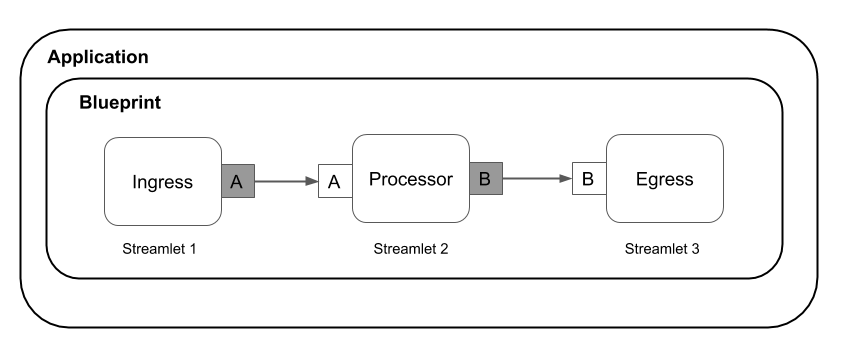

Cloudflow enables users to quickly develop, orchestrate, and operate distributed streaming applications on Kubernetes.
Cloudflow allows you to easily break down your streaming application to smaller composable components and wire them together with schema-based contracts.
Cloudflow integrates with popular streaming engines like Akka, Spark and Flink. It also comes with a powerful CLI tool to easily manage, scale and configure your streaming applications at runtime.
With its powerful abstractions, Cloudflow allows to define, build and deploy the most complex streaming applications.

- Develop: Focus only on business logic, leave the boilerplate to us.
- Build: We provide all the tooling for going from business logic to a deployable Docker image.
- Deploy: We provide Kubernetes tooling to deploy your distributed system with a single command, and manage durable connections between processing stages.
- Operate: With a Lightbend subscription, you get all the tools you need to provide insights, observability, and lifecycle management for evolving your distributed streaming application.

As data pipelines become first-class citizens in microservices architectures, Cloudflow gives developers data-optimized programming abstractions and run-time tooling for Kubernetes. 
In a nutshell, Cloudflow is an application development toolkit comprising:

- An API definition for `Streamlet`, the core abstraction in Cloudflow.
- An extensible set of runtime implementations for `Streamlet`(s). Cloudflow provides support for popular streaming runtimes, like Spark's Structured Streaming, Flink, and Akka.
- A `Streamlet` composition model driven by a `blueprint` definition.
- A sandbox execution mode that accelerates the development and testing of your applications.
- A set of `sbt` plugins that are able to package your application into a deployable container.
- The Cloudflow operator, a Kubernetes operator that manages the application lifecycle on Kubernetes.
- A CLI, in the form of a `kubectl` plugin, that facilitates manual and scripted management of the application.  

The different parts of Cloudflow work in unison to dramatically accelerate your application development efforts, reducing the time required to create, package, and deploy an application from weeks to hours.

## Basic Concepts

<i>Basic components of a Cloudflow Application</i>

As we discussed above, Cloudflow allows developers to quickly build and deploy distributed stream processing applications by breaking such applications into smaller stream processing units called `Streamlets`.
Each `Streamlet` represents an independent stream processing component that implements a self-contained stage of the application logic.
`Streamlets` let you break down your application into logical pieces that communicate with each other in a streaming fashion to accomplish an end to end goal.

`Streamlets` can be composed into larger systems using _blueprints_, which specify how `Streamlets` can be connected together to form a topology.

`Streamlets` expose one or more inlets and outlets that represent the data consumed and produced by the `Streamlet`, respectively.
Inlets and outlets are schema-driven, ensuring that data flows are always consistent and that connections between `streamlets` are compatible.
In the diagram above *Streamlet 1* has one outlet which feeds data to *Streamlet 2* inlet. *Streamlet 1* is a component that generates data or could get its data from an external system eg. via an http request.
Then *Streamlet 2* outlet feeds its data output to *Streamlet 3* inlet. *Streamlet 2* in this application does the actual data processing.
*Streamlet 3* then may store its data to some external system.
The example described here is a minimal Cloudflow application.
The data sent between `Streamlets` is safely persisted in the underlying pub-sub system, allowing for independent lifecycle management of the different components.

`Streamlets` can be scaled up and down to meet the load requirements of the application.
The underlying data streams are partitioned to allow for parallelism in a distributed application execution.

The `Streamlet` logic can be written using an extensible choice of streaming runtimes, such as Akka Streams and Spark.
The lightweight API exposes the raw power of the underlying runtime and its libraries while providing a higher-level abstraction for composing `streamlets` and expressing data schemas.
Your code is written in your familiar Structured Streaming, Flink, or Akka Streams native API.

Applications are deployed as a whole. Cloudflow takes care of deploying the individual `streamlets` and making sure connections get translated into data flowing between them at runtime.

Learn more about the Cloudflow building blocks in our [Cloudflow Core Concepts](./docs/Cloudflow-Concepts.md)

## The Drivers Behind Cloudflow

Technologies like mobile, the Internet of Things (IoT), Big Data analytics, machine learning, and others are driving enterprises to modernize how they process large volumes of data.
A rapidly growing percentage of that data is now arriving in the form of data streams.
To extract value from that data as soon as it arrives, those streams require near-realtime processing.
We use the term "Fast Data" to describe applications and systems that deal with such requirements.

The Fast Data landscape has been rapidly evolving, with tools like Spark, Flink, and Kafka Streams emerging from the world of large-scale data processing while projects like Reactive Streams and Akka Streams have emerged from the world of application development and high-performance networking.

The demand for availability, scalability, and resilience is forcing fast data architectures to become more like microservice architectures.
Conversely, successful organizations building microservices find their data needs grow with their organization while their data sources are becoming more stream-like and more real-time.
Hence, there is a unification happening between streaming data and microservice architectures.

It can be quite hard to develop, deploy, and operate large-scale microservices-based systems that can take advantage of streaming data and seamlessly integrate with systems for analytics processing and machine learning. The individual technologies are well-documented, but combining them into fully integrated, unified systems is no easy task.

Cloudflow aims to make this easier by integrating the most popular streaming frameworks into a single platform for creating and running distributed Fast Data applications on Kubernetes.

---
## Where to Go Next?

* [Getting Started with Cloudflow](https://cloudflow.io/docs/current/get-started/index.html)
* [Developing Applications with Cloudflow](https://cloudflow.io/docs/current/develop/cloudflow-streamlets.html)
* [Setup Cloudflow on a Kubernetes Cluster](./installer/README.md)
* Chat with us on [Gitter](https://gitter.im/lightbend/cloudflow)
* Ask us a question on [Discuss](https://discuss.lightbend.com/c/cloudflow)
* Want to [contribute](./CONTRIBUTING.md)?

