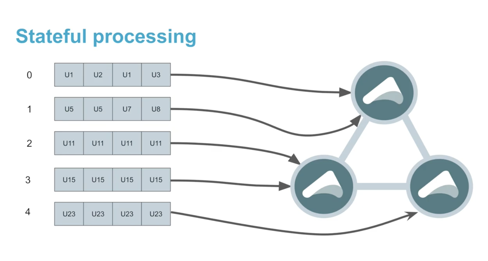

# connected-car-cloudflow
This project is designed to demonstrate the value of Akka cluster sharding
in cloudflow

This example depends on a custom branch of cloudflow

[How to co-locate Kafka Partitions with Akka Cluster Shards](https://akka.io/blog/news/2020/03/18/akka-sharding-kafka-video)

## Setup
Clone Cloudflow and change to 'cluster-streamlet' Branch
~~~~
> git clone git@github.com:nolangrace/cloudflow.git
> cd cloudflow
> git fetch
> git checkout WIP-akka-cluster-streamlet
~~~~

Build Cloudflow Locally 
~~~
> sbt publishLocal
~~~

Clone the connected car repo and change branch
~~~
> git clone git@github.com:lightbend/connected-car-pipeline.git
> cd connected-car-pipeline
> git fetch
> git checkout akka-cluster-streamlet-flag
~~~

Make sure your [Lightbend Credentials](https://www.lightbend.com/account/lightbend-platform/credential) are Setup correctly 

Build Application
~~~
> sbt buildAndPublish
~~~

Deploy Cloudflow App
~~~
> kubectl cloudflow deploy [CLOUDFLOW_IMAGE]
~~~

Setup RBAC 
~~~
> kubectl -n connected-car-pipeline apply -f rbac.yaml
~~~

Scale Cluster Streamlet
~~~
> kubectl cloudflow scale connected-car-pipeline car-cluster 3
~~~