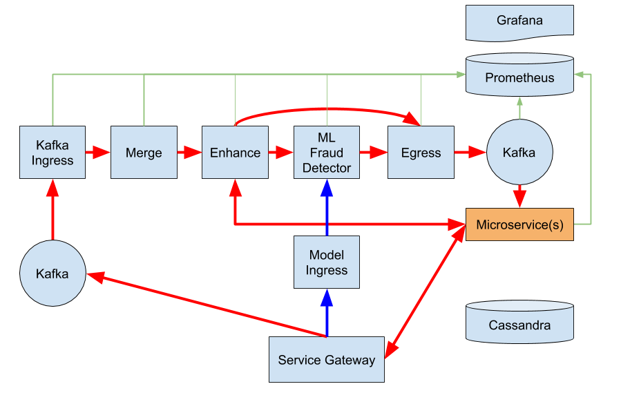

# Demo Story

## Outline

- [The Challenges of Fraud Detection](#the-challenges-of-fraud-detection)
- [The Pipelines Implementation](#the-pipelines-implementation)
- [Trusted Devices](#trusted-devices)
- [Serving Machine Learning Models](#serving-machine-learning-models)
- [Summary](#summary)

### The Challenges of Fraud Detection

TODO

### The Pipelines Implementation

Here's our Fraud Detection System:

Show the diagram below and explain how data flows through the pipeline.

Explain how:

- If data needs to be 'enhanced' by a stage we have a solution for that.
- If ML models need to be served and update we have a solution for that.
- Data leaving the pipeline can be sent to multiple endpoints.

Show the running Pipeline in the console and start pushing data in.

---

### Trusted Devices

Enhancing data can be problematic, it can often slow down a pipeline and place pressure on other systems when the pipeline is under load.

The Lightbend Platform is uniquely positioned to solve this problem as it provides a complete Reactive Microservices platform. Here we're using that platform to provide a microservice which has all the necessary data available in memory when required, but can passivate as and when necessary to save resources. Now, our pipeline can scale and our reference data store can scale with it.

> I don't aim to provide too much detail on Akka Cluster here - just enough to explain the value and how it compliments the streaming solution we're focused on to provide a complete solution.

---

### Serving Machine Learning Models

Machine Learning is a constantly-evolving field and any system that relies on ML models for its operation needs to be capable of easily updating its models in production environments. Fraud Detection measures are also constantly developing as new fraud detection algorithms are developed to counteract new attacks. 

A Pipelines Streamlet can easily be configured to handle incoming streams of serialised models. So pushing a new model to production becomes as simple as pushing a serialised model to a Kafka topic or an HTTP endpoint or whatever mechanism your data science team are comfortable with using.

> Streamlets consume streams - those streams can consist of data to be scored, or the models that are doing the scoring. In this way we can stream the processing logic as well as the data being processed. 

---

### Summary

Desiging, Building, Deploying, Monitoring and Managing real-time streaming applications can be a complex challenge.

Lightbend Pipelines eases the burden on application development teams by providing a standardised framework for building applications with a proven architectural template - and then abstracting away the manual, error-prone, boilerplate code - allowing everyone to concentrate on solving the business problem without being distracted by the Kafka problem, or the Spark problem.

Lightbend Pipelines eases the burden operationally by providing tooling for deploying each application as a single deployable unit which can be monitored from a single console. Ops teams can react to real-time metrics with the CLI tool which abstracts away the complexities of applying the same operations to each of the supported streaming technologies. 

Now you can choose the best tool for each stage of your stream-processing pipeline and integrate with supporting systems.

