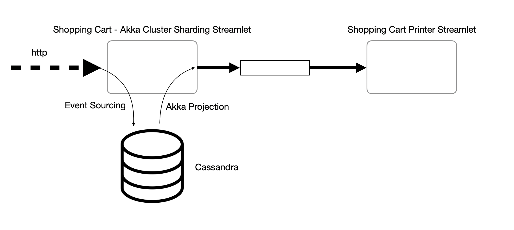

## Cloudflow CQRS Shopping Cart

### Problem Definition

This project is an example of how to leverage akka cluster sharding 
and akka projection in cloudflow



This app has not been tested deployed to K8s and is for example purposes only

### Running app Locally

**Steps:**

Start embedded Cassandra:

```bash
$ sbt "project akkaShoppingCart; runMain shoppingcart.cqrs.Main cassandra"
```

Run application Local:

```bash
$ sbt runLocal
```
