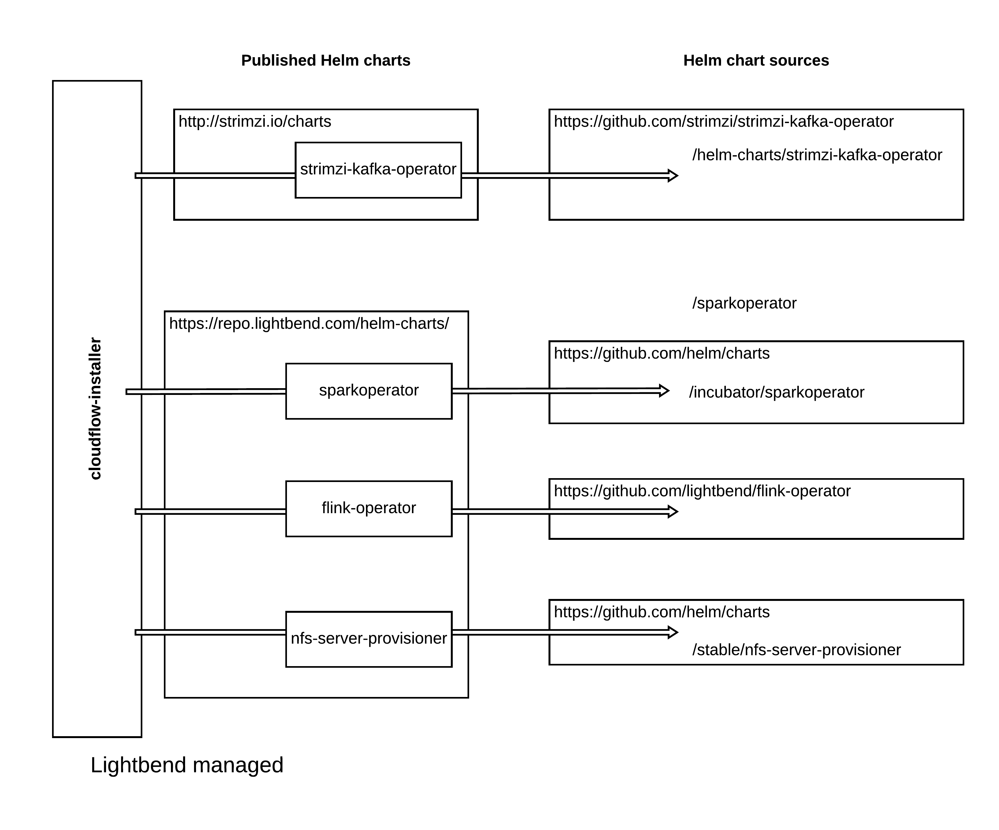

# Cloudflow Installer
## Introduction

### Prerequisite

First you need to have a running Kubernetes cluster. If you don't, refer to [Starting a Kubernetes Cluster](start-cluster.md) on how to do it on GKE, EKS or AKS.

### Installing

This project is the Cloudflow Installer, implemented as a Kubernetes operator.

The Cloudflow installer runs as a single-pod deployment and it creates a CustomResourceDefinition called `cloudflows.cloudflow-installer.lightbend.com` or `cloudflow` for short. Once the installer is up and running, the user can create an instance of the `cloudflow` CRD to trigger installation of Cloudflow itself, which includes:

- The Cloudflow operator, which orchestrates the deployment of Cloudflow applications
- The [Spark Operator](https://github.com/GoogleCloudPlatform/spark-on-k8s-operator)
- The [Flink Operator](https://github.com/lyft/flinkk8soperator)
- The [Strimzi Kafka Operator](https://strimzi.io/) used to manage Apache Kafka clusters co-located or pre-existing
- The required service accounts with the minimal permissions needed by the supporting components

[Optional] In addition, the installer deploys:

- NFS - a supporting component that provides a shareable file system to enable storage for stateful applications

**Download and run the [bootstrap script](https://github.com/lightbend/cloudflow/releases/download/v2.0.9/bootstrap-install-script-2.0.9.sh) to deploy the installer and instantiate a `cloudflow` custom resource.**:

```bash
$ ./bootstrap-install-script-<CLOUDFLOW_VERSION>.sh
```

NOTE: During installation, the installer will prompt you twice, once to select a storage class that supports *read-write-many (RWM)* and once to select a storage class that supports *read-write-once (RWO)*. Make sure you have the appropriate storage classes already available in your Kubernetes cluster before attempting to install Cloudflow. Most cloud providers already provide a default storage class that supports RWO. For your convenience, we provide a script that will install an NFS storage provisioner that supports RWM. To run it:

```bash
$./install-nfs.sh
```

The script will try to detect the version of Helm you are using and install Tiller in the cluster if using Helm 2, or directly install NFS if using Helm 3.

Other than NFS, you may want to use an RWM storage class native to your cloud provider (e.g. AzureFile on AKS and Elastic File System/EFS on EKS).

### Uninstalling

In case of a failed installation, first find the `cloudflow` custom resource:

```bash
$ kubectl get cloudflows --all-namespaces
```

And then delete  `cloudflow` objects you found in the output. This will trigger the deletion of all the component pods (e.g. Cloudflow operator). Then you can install Cloudflow again by creating another `cloudflow` custom resource.

If you want to uninstall the installer, then simply delete the namespace where the installer was deployed.

Alternatively, uninstall via:
```bash
$ uninstall.sh
```
which will run the steps mentioned above for you, assuming Cloudflow was installed in `cloudflow` namespace.

## Development

If you would like to make changes to the installer code, make sure you have the following required tools:

* `sbt`
* `make`
* `helm`
* `kubectl`

#### Testing

Currently the Cloudflow Installer is installed using `kubectl` and a yaml file located in the `/test` directory. This has been tested to work on the following Kubernetes distributions:

- Openshift 3.11 and 4.3
- GKE 1.14+
- EKS 1.14+

To use the Cloudflow Installer do the following:

1. If you made any changes to dependent Helm charts used by the installer. First `cd` into `/yaml` directory and run `make all` from there to fetch all the YAML files. **NOTE: Helm 3 is required**.
2. During development, the latest version of the docker image may not have been pushed, so build the latest version of the container using `sbt dockerBuildAndPush`. You can configure the registry (`docker.io` by default), account name (`lightbend` by default), image name (`cloudflow-installer` by default) and tag in `build.sbt` if needed.
3. Update the `image:` field in the `test/installer-deployment.yaml` file with the new docker image.
4. `kubectl apply -f test/installer-deployment.yaml` 
5. Check the status of the deployments in the `cloudflow-installer` namespace.

Once Cloudflow Installer is running, you are ready to install Cloudflow:

1. `kubectl apply -f test/cloudflowinstance.yaml`
2. Check the status of the deployments in the `cloudflow` namespace.

>Note If you have issues login to the GCR container repo on Mac, please see this [post](https://stackoverflow.com/questions/49780218/docker-credential-gcloud-not-in-system-path) on StackOverflow.

### Bootstrap script

Instead of running `kubectl apply` a bunch of YAML files, the installer also offers a one-command solution that kicks off the installation of both the installer and Cloudflow itself. This is done via a bash script that you can generate by running `make all` in the `/release` directory. You can customize the image tags to be used in the `definitions.mk` file.

Once the file `bootstrap-install-script-<VERSION>.sh` generated, run it and after a few minutes, Cloudflow will be up and running!

For each Cloudflow release starting at version 1.3.3, we provide a bootstrap script that's ready to use on the corresponding release Github page. You can find the script for 1.3.3 [here](https://github.com/lightbend/cloudflow/releases/download/v1.3.3/bootstrap-install-script-1.3.3.sh).


## Relation with other projects

The Cloudflow Installer uses the content of a number of Helm charts.

Here the detail:

[](https://www.lucidchart.com/invitations/accept/0a9e1636-03d9-4b66-bb5e-3fe9a281f1e1)

### Code formatting

The project uses `scalafmt` for formatting the source code, if you have VS Code + Metals you do not have to do anything.

If you are using any other editor combination, the Scalafmt plugin has also been included, use any of the following commands to format the code:

    myproject/scalafmt          Format main sources of myproject project
    myproject/test:scalafmt     Format test sources of myproject project
    scalafmtCheck               Check if the scala sources under the project has been formatted.
    scalafmtSbt                 Format *.sbt and project/*.scala files.
    scalafmtSbtCheck            Check if the files has been formatted by scalafmtSbt.
    scalafmtOnly                Format a single given file.
    scalafmtAll                 Execute the scalafmt task for all configurations in which it is enabled.
    scalafmtCheckAll            Execute the scalafmtCheck task for all configurations in which it is enabled.
